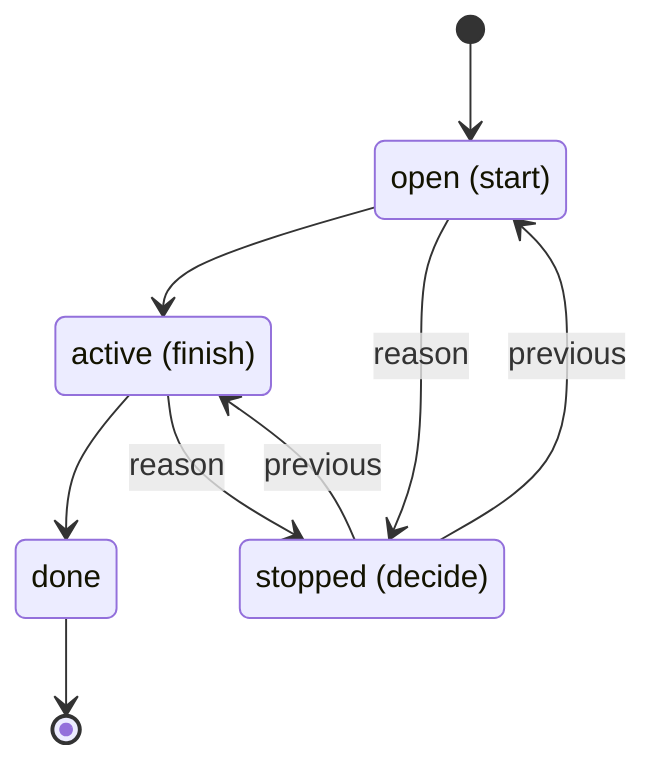

```mermaid
%% alt: State diagram of the basic preset. A new task starts in open. States: open (action start), active (action finish), done (final), stopped (action decide). Routes: open to active; active to done; open to stopped, taking a reason; active to stopped, taking a reason; stopped back to open, the state before; stopped back to active, the state before. A task ends after done.
stateDiagram-v2
    state "open (start)" as open
    state "active (finish)" as active
    state "stopped (decide)" as stopped
    [*] --> open
    open --> active
    active --> done
    open --> stopped : reason
    active --> stopped : reason
    stopped --> open : previous
    stopped --> active : previous
    done --> [*]
```
