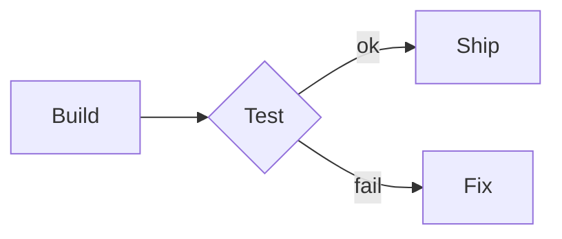
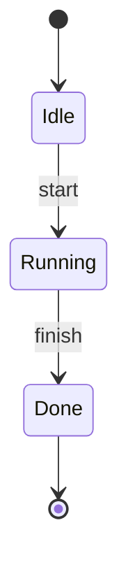

# Sample

```mermaid
%% alt: A build step feeds a test step, which either passes or fails.
flowchart LR
  build[Build] --> test{Test}
  test -->|ok| ship[Ship]
  test -->|fail| fix[Fix]
```

Some prose between the diagrams.

```mermaid
%% alt: A task moves from idle to running and then to done.
stateDiagram-v2
  [*] --> Idle
  Idle --> Running: start
  Running --> Done: finish
  Done --> [*]
```
